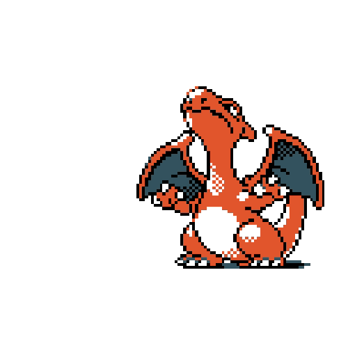

<h1 align="center">Hi there 👋</h1> 

## I’m currently working on...
My [Website](https://defeatof13.github.io) and some HB apps for various consoles

## I have experience with

## I’m currently learning...

<a target="_blank" href="">

## How to reach me: 

## OS and apps i use

## Fun fact: 
My passion for programming & coding came to light when I modded my first console (the Nintendo Wii) back in December 2021 and from there, a world opened up to me

## Support me!

